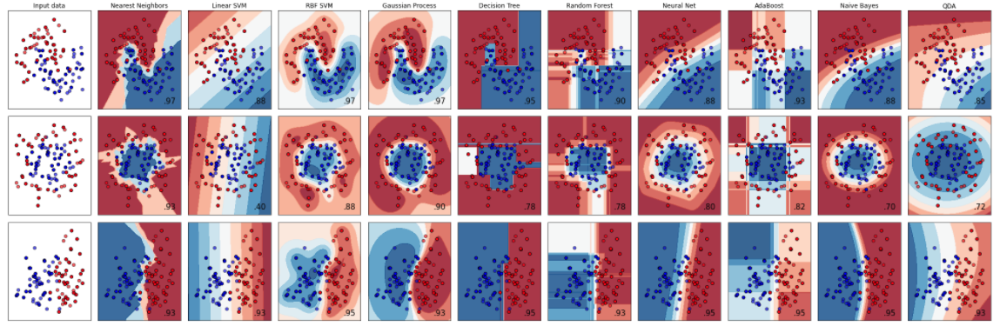

# Machine Learning

This repo includes a collection of both supervised and unsupervised machine learning algorithms, all in python, and leveraging Open Source packages like [scikitlearn](https://scikit-learn.org/stable/index.html).  
The goal of this repo is to familiarize ourselves with these algorithms, applied to various data sets and use cases and see if there are good candidates to onboard into our projects or platform(s).

To note I am also capturing additional notebooks that leverage Amazon SageMaker and their own improved implementation of some of these algorithms in this [aws-sagemaker-notebooks](https://github.com/FabG/aws-sagemaker-notebooks) repo.

### 1. Installation & How to Run
It is highly recommended to utilize a virtual environment like [virtualenv](https://pypi.org/project/virtualenv/) or [conda](https://docs.conda.io/projects/conda/en/latest/user-guide/tasks/manage-environments.html) due to this project having several libraries to import.
Also please use [Python 3](https://www.python.org/download/releases/3.0/) (and not python 2.X)

Install the python packages (after setting up your virtual environment):
`pip3 install -r requirements.txt`

Finally, you will need [Jupyter](https://jupyter.org/) to run the notebooks:
 - Jupyter Lab install (recommended): `pip install jupyterlab`
 - Classic Jupyter Notebook install: `pip install notebook`

Once installed, run:
 - Jupyter Lab: `jupyter-lab`
 - or Jupyter Notebook: `jupyter notebook`

### 2. Collection of Notebooks showcasing different ML algorithms

#### 2.1 Supervised algorithms
##### 2.1.1 SVM (Support vector machines)
###### SVM Intro
[SVM](https://scikit-learn.org/stable/modules/svm.html) Support vector machines (SVMs) are a set of supervised learning methods used for **classification**, **regression** and **outliers detection**.

The **advantages** of support vector machines are:
- Effective in high dimensional spaces.
- Still effective in cases where number of dimensions is greater than the number of samples.
- Uses a subset of training points in the decision function (called support vectors), so it is also memory efficient.
- Versatile: different Kernel functions can be specified for the decision function. Common kernels are provided, but it is also possible to specify custom kernels.

The **disadvantages** of support vector machines include:
- If the number of features is much greater than the number of samples, avoid over-fitting in choosing Kernel functions and regularization term is crucial.
- SVMs do not directly provide probability estimates, these are calculated using an expensive five-fold cross-validation (see Scores and probabilities, below).

###### SVM Notebooks
- [SVM binary classifier on Cancer data](supervised-ml/svm/svm_classifier_breast_cancer/svm_classifier_cancer.ipynb)
- [SVM and other binary classifiers on Cancer Data](supervised-ml/svm/svm_classifier_breast_cancer/multiple_classifiers_cancer.ipynb) => SVM, Logistic Regression, KNeighbor, Naïve Bayes, Random Forest, Decision Tree
- [SVM on Credit Card Fraud data](supervised-ml/svm/svm_classifier_credit_card_fraud/svm_credit_card_fraud.ipynb)

##### 2.1.2 Random Forest
Random forest, like its name implies, consists of a large number of individual decision trees that operate as an ensemble.
It can be used for **classification**, **regression** and other tasks that operate by constructing a multitude of decision trees at training time and outputting the class that is the mode of the classes (classification) or mean/average prediction (regression) of the individual trees.
For example, in a regression problem, each decision tree in the forest considers a random subset of features when forming questions and only has access to a random set of the training data points. This increases diversity in the forest leading to more robust overall predictions and the name ‘random forest.’ When it comes time to make a prediction, the random forest takes an average of all the individual decision tree estimates.

###### RandomForest Notebooks
 - [RandomForest as a Multi-classifier Vs Decision Tree and GuassianNB on Wine data](supervised-ml/random-forest/random-forest-game-of-wines.ipynb)

##### 2.2 Supervised algorithms - comparing Classifiers
 - [Classifier Comparison plot](supervised-ml/classifiers/classifier_comparison_plot.ipynb)

Here is how classifiers compares based on 3 different synthetic datasets.
The point of this example is to illustrate the nature of decision boundaries of different classifiers. This should be taken with a grain of salt, as the intuition conveyed by these examples does not necessarily carry over to real datasets

#### 2.2 Unsupervised algorithms
