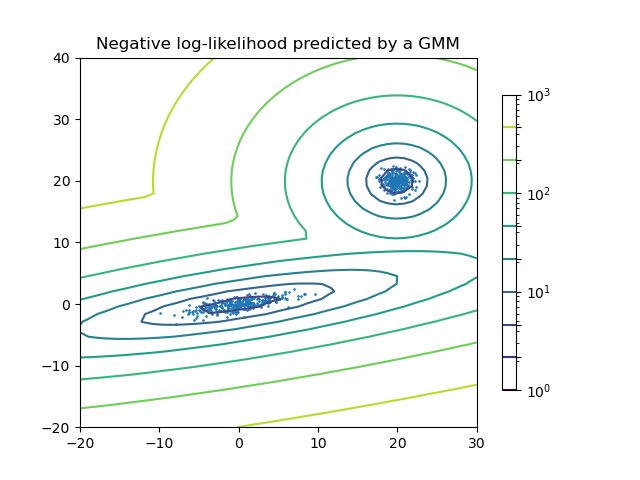

# Machine Learning

This repo includes a collection of both supervised and unsupervised machine learning algorithms, all in python, and leveraging Open Source packages like [scikitlearn](https://scikit-learn.org/stable/index.html).  
The goal of this repo is to familiarize ourselves with these algorithms, applied to various data sets and use cases and see if there are good candidates to onboard into our projects or platform(s).

To note I am also capturing additional notebooks that leverage Amazon SageMaker and their own improved implementation of some of these algorithms in this [aws-sagemaker-notebooks](https://github.com/FabG/aws-sagemaker-notebooks) repo.

### 1. Installation & How to Run
It is highly recommended to utilize a virtual environment like [virtualenv](https://pypi.org/project/virtualenv/) or [conda](https://docs.conda.io/projects/conda/en/latest/user-guide/tasks/manage-environments.html) due to this project having several libraries to import.
Also please use [Python 3](https://www.python.org/download/releases/3.0/) (and not python 2.X)

Install the python packages (after setting up your virtual environment):
`pip3 install -r requirements.txt`

Finally, you will need [Jupyter](https://jupyter.org/) to run the notebooks:
 - Jupyter Lab install (recommended): `pip install jupyterlab`
 - Classic Jupyter Notebook install: `pip install notebook`

Once installed, run:
 - Jupyter Lab: `jupyter-lab`
 - or Jupyter Notebook: `jupyter notebook`

### 2. Collection of Notebooks showcasing different ML algorithms

#### 2.0.1 Feature Engineering Notebooks
Before showcasing different algorithms in supervised and unsupervised ML, it is important to also prepare the data or features that the algorithms will be fit on. For that purpose, below is a list of notebooks that show various Feature Engineering techniques.

 - [1 - Intro to Nympy and Pandas](feature-engineering/1-intro-numpy-pandas.ipynb)

 - [10 - Feature Engineering with Categorical Data, Text and Images](feature-engineering/10-feature-engineering-categorical-data-text-images.ipynb)

#### 2.0.2 Data Visualization Notebooks
Below are some notebooks featuring `matplotlib` to plot features.
- [1 - Intro to matplotlib](visualization/1-intro-matplotlib.ipynb)
- [2 - Line plot](visualization/2-simple-line-plot.ipynb)
- [3 - Scatter plot](visualization/3-simple-scatter-plot.ipynb)
- [4 - Error bar plot](visualization/4-errorbar.ipynb)
- [5 - Density and Contour Plots](visualization/5-density-contour-plots.ipynb)
- [6 - Histograms and Binnings](visualization/6-histograms-binnings.ipynb)

#### 2.1 Supervised algorithms
##### 2.1.1 Naive Bayes (Classification)
**Naive Bayes** models are a group of extremely **fast and simple classification algorithm that are often suitable for very high-dimensional datasets**. Because they are so fast and have so few tunable parameters, they end up being very useful as a quick-and-dirty **baseline for a classification problem**.

When to use Naive Bayes?
Because naive Bayesian classifiers make such stringent assumptions about data, they will generally not perform as well as a more complicated model. That said, they have several advantages:

- They are extremely fast for both training and prediction
- They provide straightforward probabilistic prediction
- They are often very easily interpretable
- They have very few (if any) tunable parameters

These advantages mean a naive Bayesian classifier is often a good choice as an initial baseline classification. If it performs suitably, then congratulations: you have a very fast, very interpretable classifier for your problem. If it does not perform well, then you can begin exploring more sophisticated models, with some baseline knowledge of how well they should perform.

Naive Bayes classifiers tend to perform especially well in one of the following situations:

- When the naive assumptions actually match the data (very rare in practice)
- For very well-separated categories, when model complexity is less important
- For very high-dimensional data, when model complexity is less important

###### Naive Bayes Notebooks
- [In Depth - Naive Bayes](supervised-ml/naive-bayes/naive-bayes.ipynb)
- [Naive Bayes on titanic Kaggle dataset](supervised-ml/naive-bayes/naive-bayes-titanic.ipynb)

##### 2.1.2 Linear Regression (Regression)
[Linear Regression](https://scikit-learn.org/stable/modules/generated/sklearn.linear_model.LinearRegression.html) models are supervised learning models. They are usually a good starting point for regression tasks. Such models are popular because they can be fit very quickly, and are very interpretable. You can have the simplest form of a linear regression model (i.e., fitting a straight line to data) but can also have models extended to more complicated data behavior.

###### Linear Regression Notebooks
- [In depth - Linear Regression](supervised-ml/linear-regression/linear-regression.ipynb)

##### 2.1.3 SVM - Support vector machines (Regression/Classification)
[SVM](https://scikit-learn.org/stable/modules/svm.html) Support vector machines (SVMs) are a set of supervised learning methods used for **classification**, **regression** and **outliers detection**.

The **advantages** of support vector machines are:
- Effective in high dimensional spaces.
- Still effective in cases where number of dimensions is greater than the number of samples.
- Uses a subset of training points in the decision function (called support vectors), so it is also memory efficient.
- Versatile: different Kernel functions can be specified for the decision function. Common kernels are provided, but it is also possible to specify custom kernels.

The **disadvantages** of support vector machines include:
- If the number of features is much greater than the number of samples, avoid over-fitting in choosing Kernel functions and regularization term is crucial.
- SVMs do not directly provide probability estimates, these are calculated using an expensive five-fold cross-validation (see Scores and probabilities, below).

###### SVM Notebooks
- [In Depth - Support Vector Machine](supervised-ml/svm/support-vector-machine.ipynb)
- [SVM binary classifier on Cancer data](supervised-ml/svm/svm_classifier_breast_cancer/svm_classifier_cancer.ipynb)
- [SVM and other binary classifiers on Cancer Data](supervised-ml/svm/svm_classifier_breast_cancer/multiple_classifiers_cancer.ipynb) => SVM, Logistic Regression, KNeighbor, Naïve Bayes, Random Forest, Decision Tree
- [SVM on Credit Card Fraud data](supervised-ml/svm/svm_classifier_credit_card_fraud/svm_credit_card_fraud.ipynb)

##### 2.1.4 Random Forest (Classification/Regression)
Random forest, like its name implies, consists of a large number of individual decision trees that operate as an ensemble.
It can be used for **classification**, **regression** and other tasks that operate by constructing a multitude of decision trees at training time and outputting the class that is the mode of the classes (classification) or mean/average prediction (regression) of the individual trees.
For example, in a regression problem, each decision tree in the forest considers a random subset of features when forming questions and only has access to a random set of the training data points. This increases diversity in the forest leading to more robust overall predictions and the name ‘random forest.’ When it comes time to make a prediction, the random forest takes an average of all the individual decision tree estimates.

Random forests are a powerful method with several advantages:
- Both training and prediction are very fast, because of the simplicity of the underlying decision trees. In addition, both tasks can be straightforwardly parallelized, because the individual trees are entirely independent entities.
- The multiple trees allow for a probabilistic classification: a majority vote among estimators gives an estimate of the probability (accessed in Scikit-Learn with the predict_proba() method).
- The nonparametric model is extremely flexible, and can thus perform well on tasks that are under-fit by other estimators.

A primary disadvantage of random forests is that the results are not easily interpretable: that is, if you would like to draw conclusions about the meaning of the classification model, random forests may not be the best choice.

###### RandomForest Notebooks
 - [In depth - Random Forest](supervised-ml/random-forest/random-forests.ipynb)
 - [RandomForest as a Multi-classifier Vs Decision Tree and GuassianNB on Wine data](supervised-ml/random-forest/random-forest-game-of-wines.ipynb)

##### 2.1.5 Image Feature Extraction with HOG (Histogram of Oriented Gradients
**HOG** (Histogram of Oriented Gradients) is a feature extraction technique which transforms image pixels into a vector representation that is sensitive to broadly informative image features regardless of confounding factors like illumination.

###### HOG Notebooks
- [Image Feature Extraction HOG](supervised-ml/skimage-hog/image-features.ipynb)

##### 2.2 Supervised algorithms - comparing Classifiers
 - [Classifier Comparison plot](supervised-ml/classifiers/classifier_comparison_plot.ipynb)

Here is how classifiers compares based on 3 different synthetic datasets.
The point of this example is to illustrate the nature of decision boundaries of different classifiers. This should be taken with a grain of salt, as the intuition conveyed by these examples does not necessarily carry over to real datasets

#### 2.3 Unsupervised algorithms

##### 2.3.1 PCA - Principal Component Analysis
PCA is fundamentally a dimensionality reduction algorithm, but it can also be useful as a tool for visualization, for noise filtering, for feature extraction and engineering, and much more.

Note: PCA is effected by scale so you need to scale the features in your data before applying PCA. Use `StandardScaler` to help you standardize the dataset’s features onto unit scale (mean = 0 and variance = 1) which is a requirement for the optimal performance of many machine learning algorithms.  
If you want to see the negative effect not scaling your data can have, scikit-learn has a section on the [effects of not standardizing your data](https://scikit-learn.org/stable/auto_examples/preprocessing/plot_scaling_importance.html#sphx-glr-auto-examples-preprocessing-plot-scaling-importance-py)

###### PCA Notebooks
 - [In Depth - Principal Component Analysis )](unsupervised-ml/pca/principal-component-analysis.ipynb) => Dimension reduction, Visualization and Noise filtering
 - [PCA - Data Visualization](unsupervised-ml/pca/pca-for-data-visualization.ipynb)
 - [PCA - To Speed Up ML](unsupervised-ml/pca/pca-to-speed-up-ml.ipynb)
 - [PCA - Dimension reduction on heart data](unsupervised-ml/pca/pca-heart-disease.ipynb)
 - [PCA - Dimension reduction on gym crowdedness data](unsupervised-ml/pca/pca-crowdedness-gym.ipynb)

 ##### 2.3.2 Manifold Learning
 The previous algorithm principal component analysis (PCA) can be used in the dimensionality reduction task — reducing the number of features of a dataset while maintaining the essential relationships between the points. While PCA is flexible, fast, and easily interpretable, it does not perform so well when there are **nonlinear relationships** within the data.

 To address this deficiency, we can turn to a class of methods known as [Manifold Learning](https://scikit-learn.org/stable/modules/manifold.html) — a class of unsupervised estimators that seeks to describe datasets as low-dimensional manifolds embedded in high-dimensional spaces.

 Manifold learning is an approach to non-linear dimensionality reduction. Algorithms for this task are based on the idea that the dimensionality of many data sets is only artificially high.
 Manifold Learning can be thought of as an attempt to generalize linear frameworks like PCA to be sensitive to non-linear structure in data. Though supervised variants exist, the typical manifold learning problem is unsupervised: it learns the high-dimensional structure of the data from the data itself, without the use of predetermined classifications.
 The manifold learning implementations available in scikit-learn are summarized:
 - Isomap algorithm, short for Isometric Mapping. Isomap can be viewed as an extension of Multi-dimensional Scaling (MDS) or Kernel PCA. Isomap seeks a lower-dimensional embedding which maintains geodesic distances between all points.
 - Locally linear embedding (LLE) seeks a lower-dimensional projection of the data which preserves distances within local neighborhoods. It can be thought of as a series of local Principal Component Analyses which are globally compared to find the best non-linear embedding.
 - Modified locally linear embedding (MLLE) - When the number of neighbors is greater than the number of input dimensions, use multiple weight vectors in each neighborhood as a regularization.
 - Multi-dimensional Scaling (MDS) - seeks a low-dimensional representation of the data in which the distances respect well the distances in the original high-dimensional space. In general, MDS is a technique used for analyzing similarity or dissimilarity data. It attempts to model similarity or dissimilarity data as distances in a geometric spaces. The data can be ratings of similarity between objects, interaction frequencies of molecules, or trade indices between countries.
 ..

###### Manifold Learning Notebooks
 - [In Depth - Manifold Learning](unsupervised-ml/manifold/manifold-learning.ipynb)

##### 2.3.3 K-Means
The [K-Means](https://scikit-learn.org/stable/modules/generated/sklearn.cluster.KMeans.html) algorithm clusters data by trying to separate samples in n groups of equal variance, minimizing a criterion known as the inertia or within-cluster sum-of-squares (see below). This algorithm requires the number of clusters to be specified. It scales well to large number of samples and has been used across a large range of application areas in many different fields.

###### K-Means Learning Notebooks
 - [In Depth - K-Means](unsupervised-ml/k-means/k-means.ipynb)

##### 2.3.4 GMM (Gaussian Mixture Models)
[GMM](https://scikit-learn.org/stable/modules/mixture.html) is a package which enables one to learn Gaussian Mixture Models (diagonal, spherical, tied and full covariance matrices supported), sample them, and estimate them from data. Facilities to help determine the appropriate number of components are also provided.

A Gaussian mixture model is a probabilistic model that assumes all the data points are generated from a mixture of a finite number of Gaussian distributions with unknown parameters. One can think of mixture models as generalizing k-means clustering to incorporate information about the covariance structure of the data as well as the centers of the latent Gaussians.

###### GMM Notebooks
 - [In Depth - Gaussian Mixture Models](unsupervised-ml/gaussian-mixture/gaussian-mixtures.ipynb)

##### 2.3.5 Kernel Density Estimation
[KernelDensity](https://scikit-learn.org/stable/modules/generated/sklearn.neighbors.KernelDensity.html)  estimation walks the line between unsupervised learning, feature engineering, and data modeling. Some of the most popular and useful density estimation techniques are mixture models such as Gaussian Mixtures.
The free parameters of kernel density estimation are the `kernel`, which specifies the shape of the distribution placed at each point, and the `kernel bandwidth`, which controls the size of the kernel at each point.
More information [here](https://scikit-learn.org/stable/modules/density.html)

###### Kerne Density Notebooks
 - [In Depth - Kernel Density Estimation](unsupervised-ml/kernel-density-estimation/kernel-density-estimation.ipynb)

#### 3 Resources
 - [Kaggle game of wines](https://www.kaggle.com/booleanhunter/game-of-wines)
 - [In depth Principal Component Analysis](https://jakevdp.github.io/PythonDataScienceHandbook/05.09-principal-component-analysis.html)
 - [Python Data Science handbook (and notebooks)](https://github.com/jakevdp/PythonDataScienceHandbook)
 - [Machine Learning with Scikit-learn](https://www.linkedin.com/learning/machine-learning-with-scikit-learn/effective-machine-learning-with-scikit-learn)
